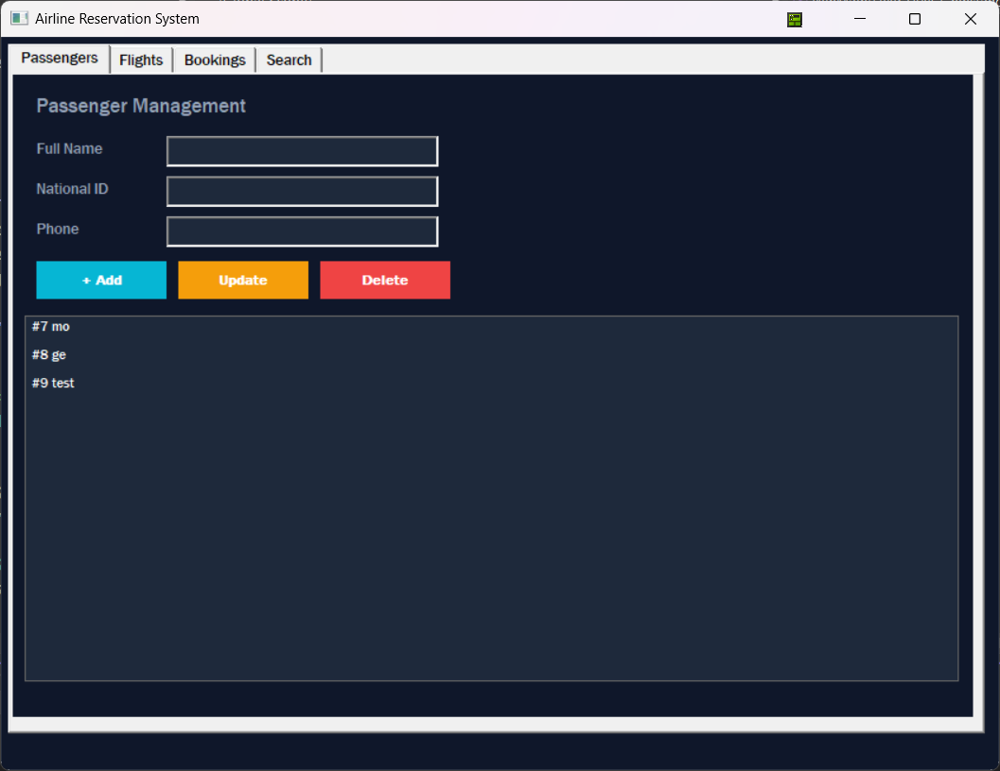
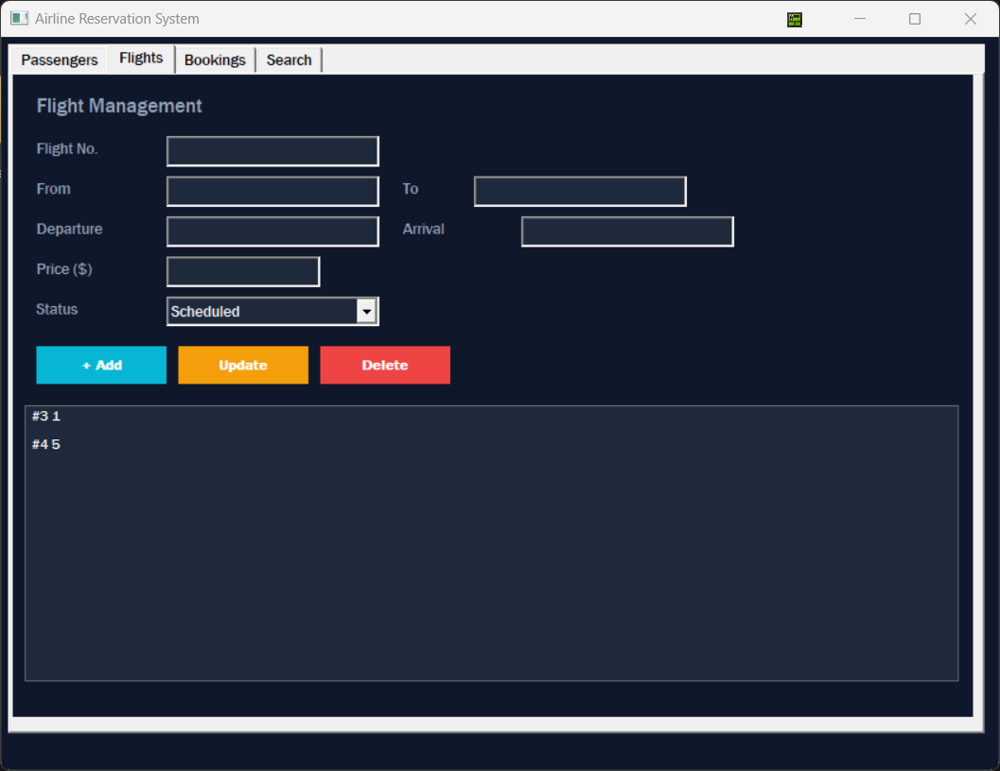
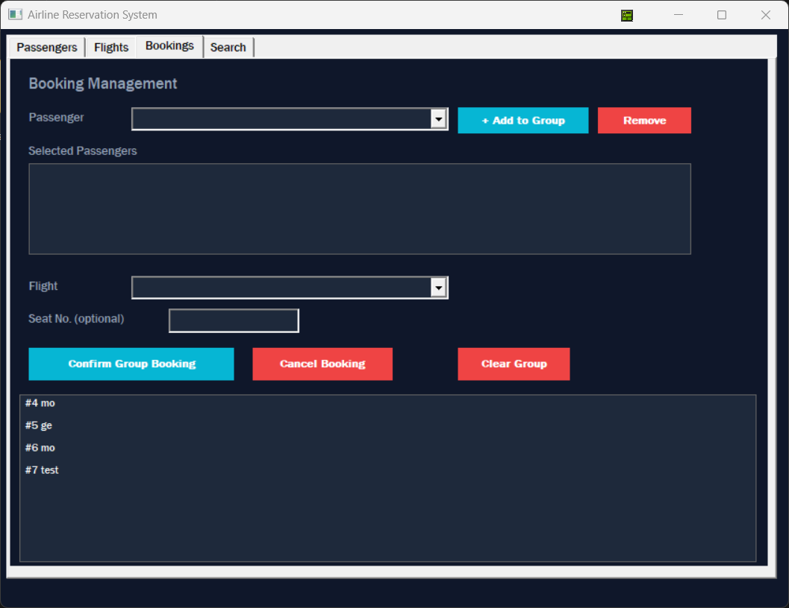
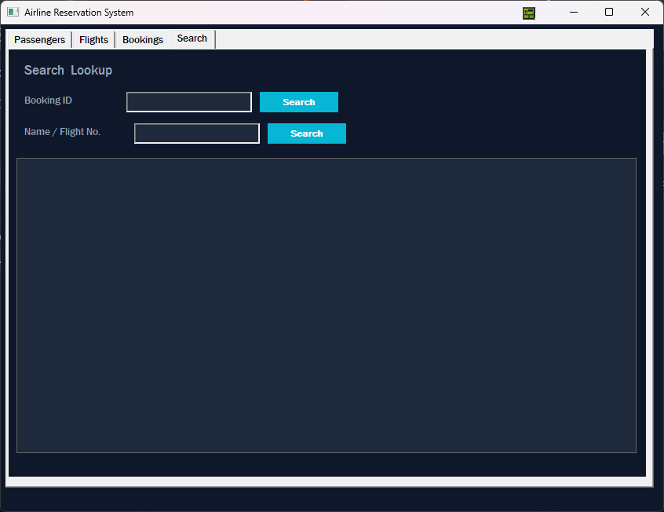

# ✈️ Airline Reservation System

<p align="center">
  
  
  
  
  
</p>

<p align="center">
  A fully functional <strong>Windows Desktop Application</strong> for managing airline flights, passengers, and reservations.<br/>
  Built with <strong>C++ Win32 API</strong> and <strong>SQLite3</strong> as the embedded local database — no server required.
</p>

---

## 📋 Table of Contents

- [About the Project](#-about-the-project)
- [Screenshots](#-screenshots)
- [Features](#-features)
- [Database Structure](#-database-structure)
- [Tech Stack](#-tech-stack)
- [Getting Started](#-getting-started)
- [How to Use](#-how-to-use)
- [Project Structure](#-project-structure)
- [Author](#-author)

---

## 📌 About the Project

This project is a **Windows Desktop Application** developed using **C++** with the native **Win32 API** in Visual Studio. It simulates a real-world airline reservation system where an administrator can manage flights, register passengers, handle individual and group bookings, and search records — all stored persistently in a local **SQLite3** database file (`airline.db`).

Built as part of the **Windows Programming** course at **Delta Technological University**, the project demonstrates:

- Native Windows GUI development using Win32 API (Tab Controls, ListBoxes, ComboBoxes, Buttons, Edit Controls)
- Embedded SQLite3 database integration (no external server)
- Full **CRUD** operations — Create, Read, Update, Delete — on all entities
- Two independent search strategies on booking records
- **Group booking** support for up to 9 passengers on a single flight
- Custom-drawn dark-themed UI with color-coded action buttons

---

## 📸 Screenshots

### 🏠 Passengers Tab

> Add, update, and delete passengers. Click any row to auto-fill the form fields for editing.

---

### ✈️ Flights Tab

> Manage all flights with number, origin, destination, departure/arrival times, price, and status (Scheduled / Delayed / Cancelled / Boarded / Completed).

---

### 🎫 Bookings Tab

> Book a single passenger or an entire group (up to 9) on a selected flight. Cancel any existing booking from the list.

---

### 🔍 Search Tab

> **Search Method 1 — By Booking ID:** Enter an exact booking ID to retrieve a specific record instantly.<br/>
> **Search Method 2 — By Name or Flight Number:** Enter any keyword to find all matching bookings by passenger name or flight code.

---

## ⚙️ Features

| Feature | Details |
|---|---|
| ✅ **Passenger Management** | Add, update, delete passengers (Name, National ID, Phone) |
| ✅ **Flight Management** | Add, update, delete flights (Number, From, To, Departure, Arrival, Price, Status) |
| ✅ **Single Booking** | Book one passenger on a selected flight with optional seat number |
| ✅ **Group Booking** | Add up to 9 passengers to a group and book them all on one flight at once |
| ✅ **Cancel Booking** | Delete any booking record from the system |
| ✅ **Search by Booking ID** | Exact lookup of a booking by its unique ID |
| ✅ **Search by Name / Flight No.** | Partial keyword search across passenger names and flight numbers |
| ✅ **Auto-fill on Selection** | Clicking a list item fills the form automatically for fast editing |
| ✅ **Flight Status Tracking** | Flights can be marked as Scheduled, Delayed, Cancelled, Boarded, or Completed |
| ✅ **Dark Theme UI** | Custom-painted dark background with color-coded buttons (Cyan = Add, Amber = Update, Red = Delete) |
| ✅ **SQLite3 Embedded DB** | All data persists in `airline.db` — created automatically on first run |
| ✅ **No External Dependencies** | `sqlite3.h` + `sqlite3.c` bundled directly in the project |

---

## 🗄️ Database Structure

The application uses **3 tables** in SQLite3:

```
Passengers
├── id          INTEGER  PRIMARY KEY AUTOINCREMENT
├── name        TEXT     NOT NULL
├── nationalID  TEXT     UNIQUE NOT NULL
└── phone       TEXT

Flights
├── id            INTEGER  PRIMARY KEY AUTOINCREMENT
├── flightNumber  TEXT     NOT NULL UNIQUE
├── fromCity      TEXT     NOT NULL
├── toCity        TEXT     NOT NULL
├── departure     DATETIME NOT NULL        e.g. "2026-06-15 14:30"
├── arrival       DATETIME NOT NULL        e.g. "2026-06-15 17:00"
├── price         REAL     NOT NULL
└── status        TEXT     DEFAULT 'Scheduled'

Bookings
├── id           INTEGER  PRIMARY KEY AUTOINCREMENT
├── passengerID  INTEGER  FOREIGN KEY → Passengers(id)
├── flightID     INTEGER  FOREIGN KEY → Flights(id)
├── seat         TEXT
└── bookingDate  DATETIME DEFAULT CURRENT_TIMESTAMP
```

---

## 🛠️ Tech Stack

| Component | Technology |
|---|---|
| Language | C++ (MSVC) |
| GUI Framework | Win32 API — native Windows controls |
| Database | SQLite3 (amalgamation — bundled in project) |
| IDE | Microsoft Visual Studio 2019 / 2022 |
| UI Controls | Tab Control, ListBox, ComboBox, Edit, Button (custom-drawn) |
| Target OS | Windows 10 / 11 |

---

## 🚀 Getting Started

### Prerequisites

- Windows 10 or 11
- Visual Studio 2019 or 2022 with the **Desktop development with C++** workload installed
- No extra libraries needed — SQLite3 is bundled inside the project

### Build & Run

**1. Clone the repository:**
```bash
git clone https://github.com/XONepTon/airline_reservation_system.git
cd airline_reservation_system
```

**2. Open the solution in Visual Studio:**
```
File → Open → Project/Solution → airline_reservation_system.sln
```

**3. Verify SQLite files are in the project:**
- `sqlite3.h` and `sqlite3.c` must be present in the root project folder
- Both must appear in the Visual Studio Solution Explorer (add them if missing via *Add → Existing Item*)

**4. Build the solution:**
```
Ctrl + Shift + B   or   Build → Build Solution
```

**5. Run the application:**
```
F5   or   Debug → Start Debugging
```

> ✅ On first launch, `airline.db` is created automatically in the same directory as the `.exe`.

---

## 📖 How to Use

### 👤 Passengers Tab
| Action | How |
|---|---|
| Add passenger | Fill Name, National ID, Phone → click **+ Add** |
| Edit passenger | Click a row in the list → fields auto-fill → modify → click **Update** |
| Delete passenger | Click a row → click **Delete** → confirm |

### ✈️ Flights Tab
| Action | How |
|---|---|
| Add flight | Fill all fields, pick a Status → click **+ Add** |
| Edit flight | Click a row → fields auto-fill → modify → click **Update** |
| Delete flight | Click a row → click **Delete** → confirm |
| Departure/Arrival format | Use `YYYY-MM-DD HH:MM` — e.g. `2026-06-15 14:30` |

### 🎫 Bookings Tab
| Action | How |
|---|---|
| Single booking | Select Passenger + Flight → optionally enter Seat → click **Confirm Group Booking** |
| Group booking | Select each passenger → click **+ Add to Group** (repeat up to 9) → select Flight → click **Confirm Group Booking** |
| Cancel booking | Click a booking in the list → click **Cancel Booking** → confirm |
| Clear group | Click **Clear Group** to reset the selection |

### 🔍 Search Tab
| Search Type | How |
|---|---|
| By Booking ID | Enter the numeric ID → click **Search** (left button) |
| By Name or Flight No. | Enter any keyword → click **Search** (right button) — supports partial match |

---

## 📁 Project Structure

```
airline_reservation_system/
│
├── main.cpp                  # Full application — WinMain, WndProc, all UI & DB logic
├── sqlite3.h                 # SQLite3 amalgamation header
├── sqlite3.c                 # SQLite3 amalgamation source
├── airline_reservation_system.sln
├── airline_reservation_system.vcxproj
│
├── Screenshots/              # 📂 Place your screenshots here
│   ├── passengers.png
│   ├── flights.png
│   ├── bookings.png
│   └── search.png
│
└── README.md
```

> 📝 `airline.db` is generated automatically at runtime in the same folder as the executable.

---

## 👨‍💻 Author

**Ramadan Ragab**
Faculty of Industrial Technology and Energy — Delta Technological University
Windows Programming Course — 2026

[](https://github.com/XONepTon)

---

## 📄 License

This project is developed for educational purposes as part of a university course.
Feel free to reference or build upon it for your own learning.
